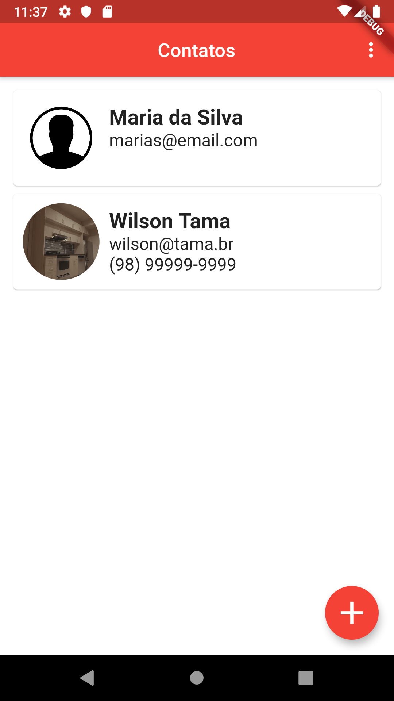
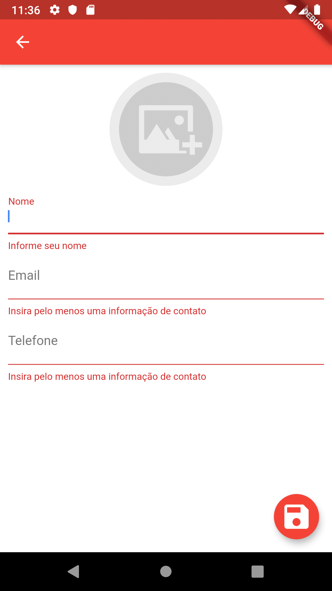
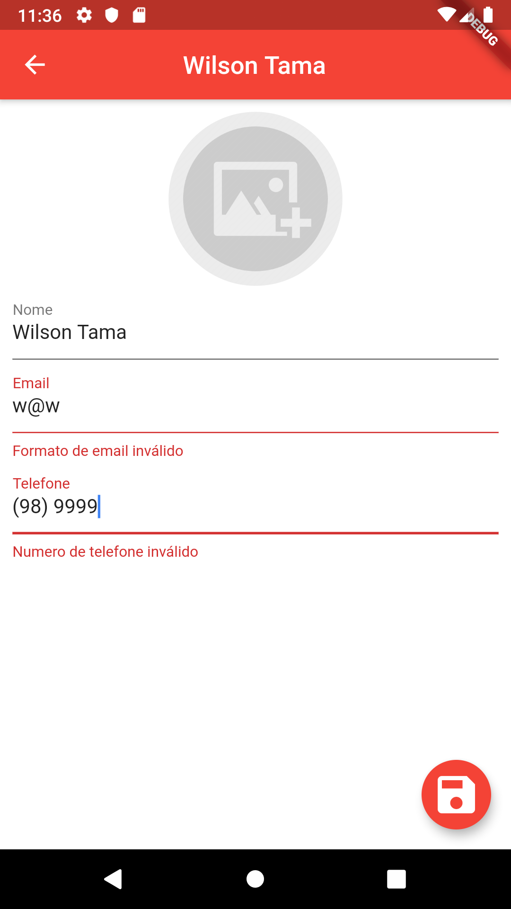
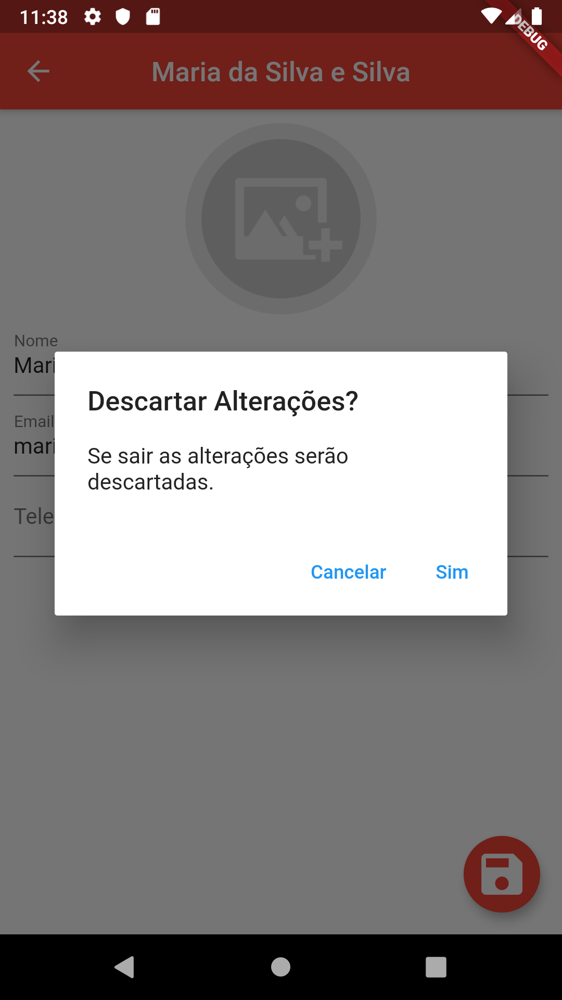
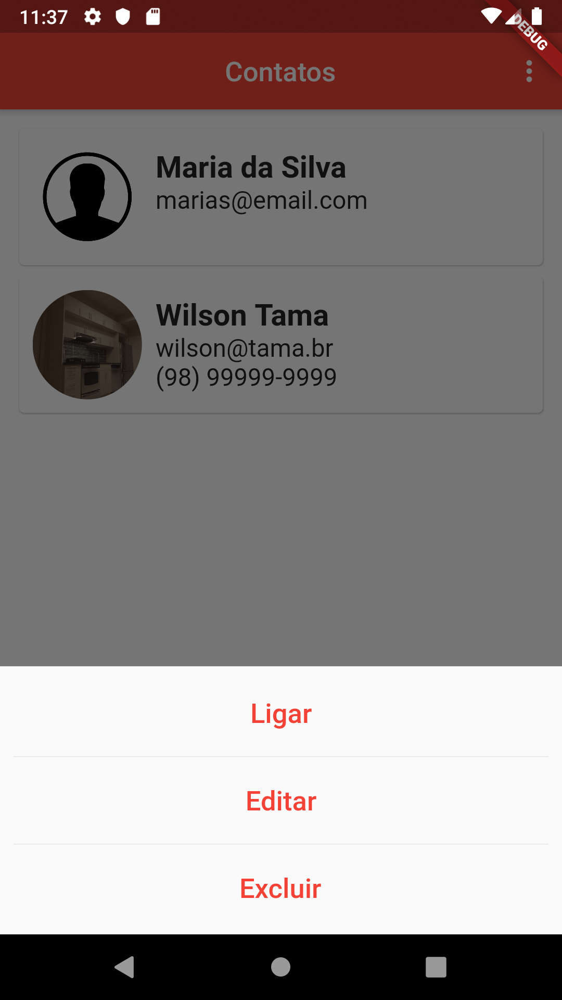

# Buscador de GIFs

Agenda de contatos.

Projeto 6 do curso [Criação de Apps Android e iOS com Flutter](https://www.udemy.com/curso-completo-flutter-app-android-ios/)

# Adições originais

- Validação dos campos via form, todo contado deve ter um nome e um email ou telefone;
- Inclusão de listeners nos controllers para tratar a mudança nos campos de texto;
- Melhoria na usabilidade no ícone de incluir imagem;
- Regex para validar o email;
- Máscara para exibir o telefone no formato correto;

 

